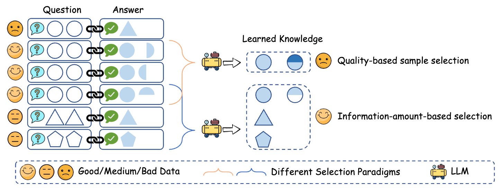
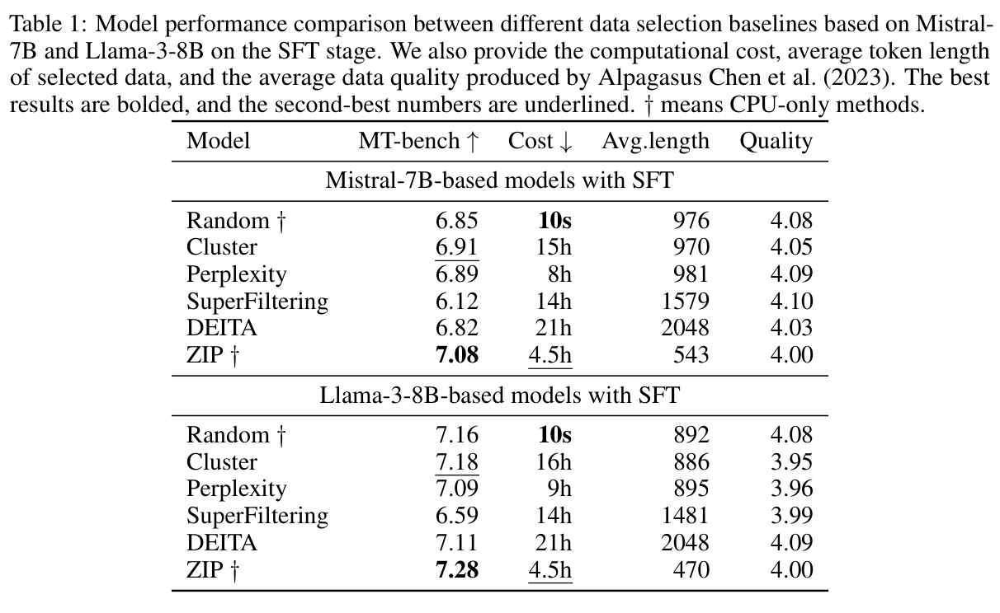
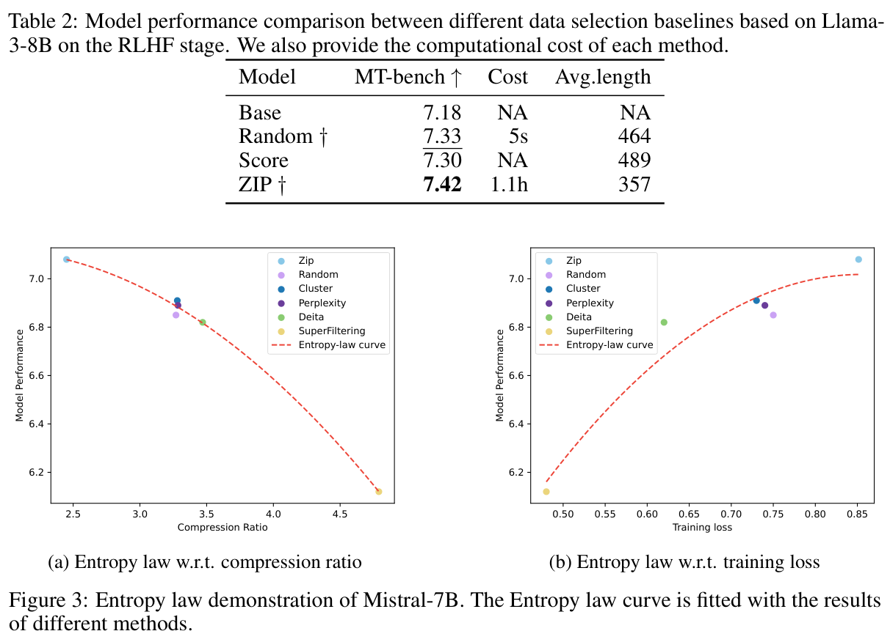

# ZIP

Official implementation for **Entropy Law: The Story Behind Data Compression and LLM Performance**.

[](https://arxiv.org/abs/2407.06645)
[](https://ustc-starteam.github.io/ZIP/)
[](LICENSE)

## 1. Paper

Mingjia Yin, Chuhan Wu, Yufei Wang, Hao Wang, Wei Guo, Yasheng Wang, Yong Liu, Ruiming Tang, Defu Lian, and Enhong Chen. **Entropy Law: The Story Behind Data Compression and LLM Performance**. arXiv preprint arXiv:2407.06645, 2024.

[Paper](https://arxiv.org/abs/2407.06645) / [PDF](https://arxiv.org/pdf/2407.06645) / [Project Page](https://ustc-starteam.github.io/ZIP/) / [Citation](#12-citation)

ZIP selects instruction data through an entropy-law view of compression: a useful selected subset should reduce redundant information while preserving diverse learning signals for LLM alignment. This repository provides the ZIP selection script and the expected ShareGPT-style input format used by the paper experiments.

## 2. Highlights

- Uses compression ratio as a data-selection signal for instruction tuning pools.
- Selects data in stages, combining global candidate filtering with local greedy selection.
- Works with ShareGPT-style conversation records and can be plugged into existing alignment stacks.
- Keeps alignment and evaluation decoupled: ZIP selects data, while Axolotl and FastChat can handle SFT and MT-Bench evaluation.

## 3. Method At A Glance



The key idea is to avoid picking a collection of individually high-quality but mutually redundant samples. ZIP repeatedly evaluates how a candidate changes the compressed representation of the selected pool, then adds samples that improve information coverage under the target budget.

## 4. Repository Structure

```text
.
├── ZIP.py                  # ZIP data-selection implementation
├── assets/motivation.png   # Motivation figure from the paper
├── docs/                   # GitHub Pages project page
└── README.md
```

## 5. Installation

Install the Python dependencies required by `ZIP.py`:

```bash
pip install torch
```

The repository keeps ZIP itself lightweight. Alignment and evaluation dependencies are managed by the external tools described below.

## 6. Data

The data pool used in the paper can be found in the [DEITA SOTA pool](https://huggingface.co/datasets/AndrewZeng/deita_sota_pool), provided by the [DEITA](https://github.com/hkust-nlp/deita) project.

ZIP currently expects ShareGPT-style records:

```json
[
  {
    "id": 0,
    "conversations": [
      {"from": "human", "value": "XXX"},
      {"from": "gpt", "value": "XXX"}
    ],
    "source": "ShareGPT"
  }
]
```

## 7. Quick Start

Run data selection with a target budget:

```bash
python ZIP.py --data_path data_pool.json --save_path selected_data.json --budget 10000
```

Optional parameters in `ZIP.py` include:

- `--k1`: number of globally filtered candidates per stage.
- `--k2`: number of second-stage candidates.
- `--k3`: number of final greedy selections per stage.
- `--n_jobs`: worker count for compression-ratio computation.

## 8. LLM Alignment And Evaluation

- Use [Axolotl](https://github.com/axolotl-ai-cloud/axolotl) to align LLMs with ZIP-selected data.
- Use MT-Bench in [FastChat](https://github.com/lm-sys/FastChat) to evaluate aligned models.

ZIP writes the selected subset to `selected_data.json`; downstream alignment tools should consume that file according to their own training format.

## 9. Configuration Notes

The main selection budget is controlled by `--budget`. Larger pools and larger candidate windows increase selection cost because ZIP repeatedly computes compression ratios for candidate combinations.

## 10. Experimental Highlights





The SFT and RLHF tables above show ZIP's MT-Bench improvements and low selection cost, while the entropy-law plots visualize the compression/performance relationship.


The paper studies why sample combinations matter for LLM data selection. ZIP is designed to reduce information redundancy rather than scoring each sample independently.

| Backbone | Random MT-Bench | Strongest listed non-ZIP baseline | ZIP MT-Bench | ZIP cost | Avg. token length |
| --- | ---: | ---: | ---: | ---: | ---: |
| Mistral-7B SFT | 6.85 | 6.91 (Cluster) | **7.08** | 4.5h CPU-only | 543 |
| Llama-3-8B SFT | 7.16 | 7.18 (Cluster) | **7.28** | 4.5h CPU-only | 470 |

The paper further reports that ZIP is among the least expensive non-random methods and does not require proprietary LLM scoring or a proxy model. Its entropy-law analysis shows that lower compression ratio correlates with better downstream performance, supporting the idea that selected sample combinations should reduce redundant information.

**Conclusion:** ZIP improves instruction-tuning data selection by modeling subset-level information overlap, not only individual-sample quality.

## 11. Notes For Maintainers

- Keep `ZIP.py` focused on data selection; do not add alignment-framework assumptions to the core selector.
- If new input schemas are supported, document the schema and add a minimal conversion example.
- Keep external data links in this README in sync with the paper's data sources.

## 12. Citation

If you find this project helpful, please cite:

```bibtex
@article{yin2024entropy,
  title={Entropy Law: The Story Behind Data Compression and LLM Performance},
  author={Yin, Mingjia and Wu, Chuhan and Wang, Yufei and Wang, Hao and Guo, Wei and Wang, Yasheng and Liu, Yong and Tang, Ruiming and Lian, Defu and Chen, Enhong},
  journal={arXiv preprint arXiv:2407.06645},
  year={2024}
}
```

## 13. Contact

- Equal-contribution authors: Mingjia Yin (`mingjia-yin@ustc.edu.cn`), Chuhan Wu (`wuchuhan1@huawei.com`), Yufei Wang (no verified public email found), and Hao Wang (`wanghao3@ustc.edu.cn`).
- Corresponding authors: Chuhan Wu (`wuchuhan1@huawei.com`), Hao Wang (`wanghao3@ustc.edu.cn`), Ruiming Tang (`tangruiming@huawei.com`), and Enhong Chen (`cheneh@ustc.edu.cn`).
- Repository questions: please open a GitHub issue in this repository.
